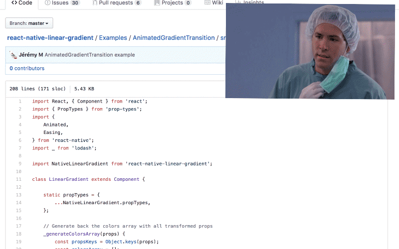
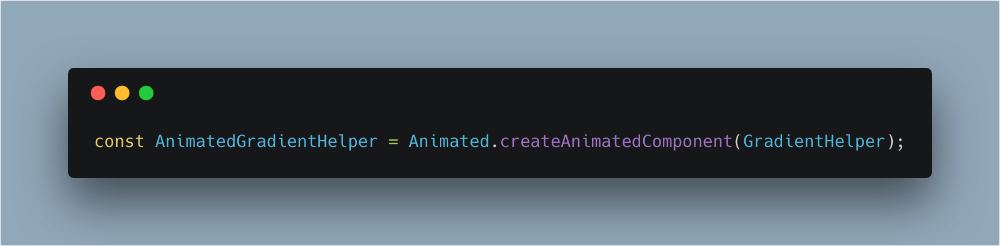
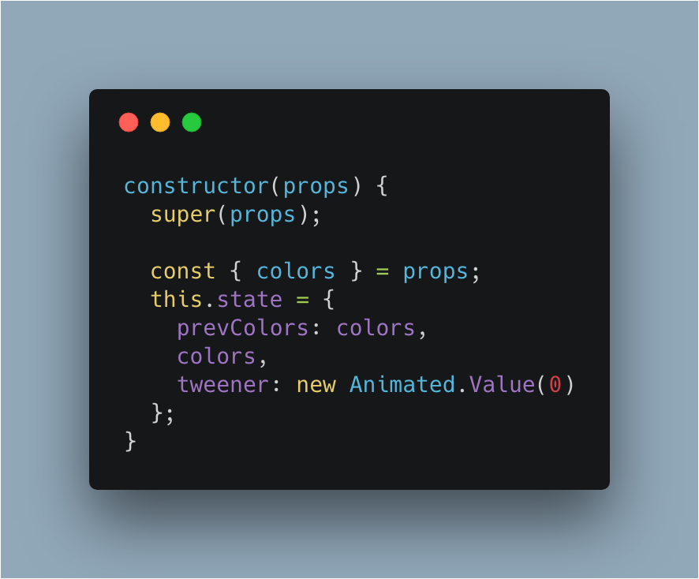
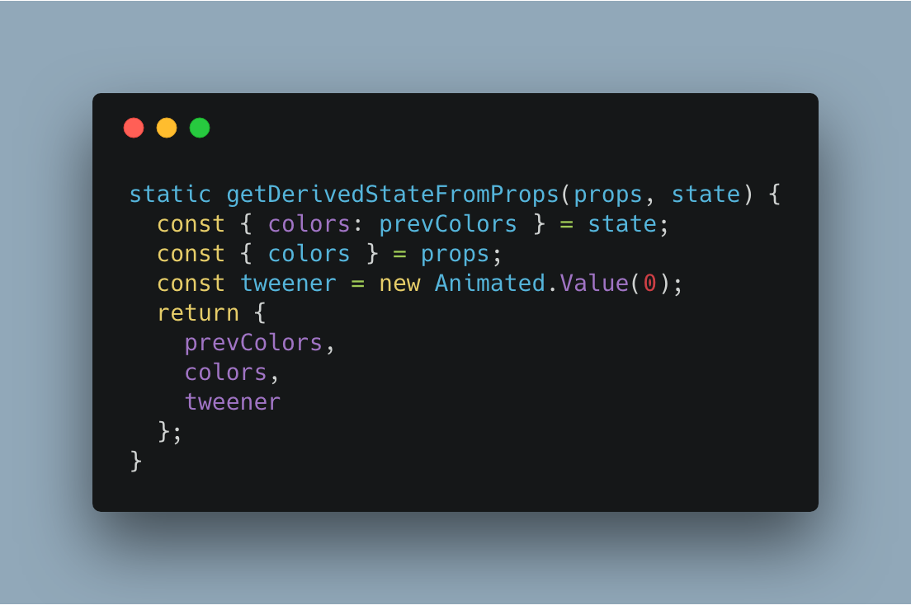
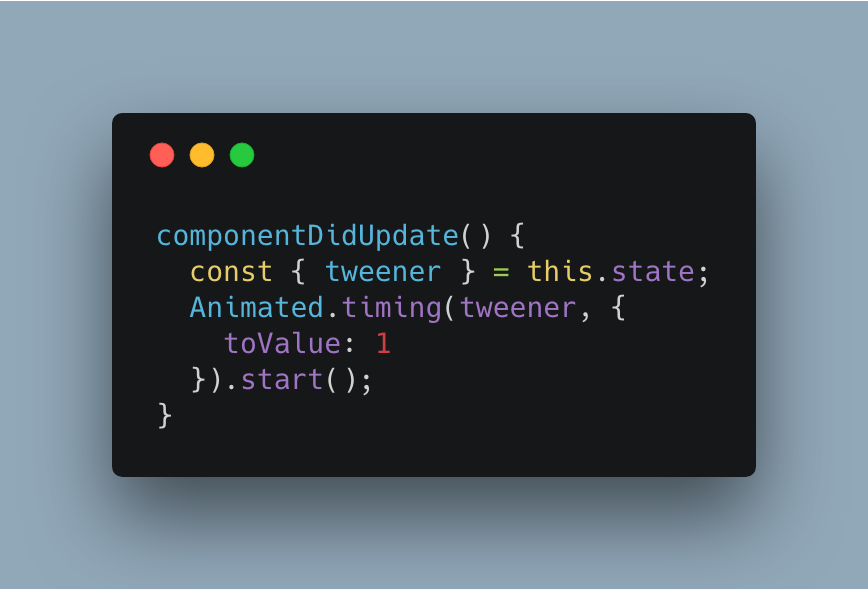
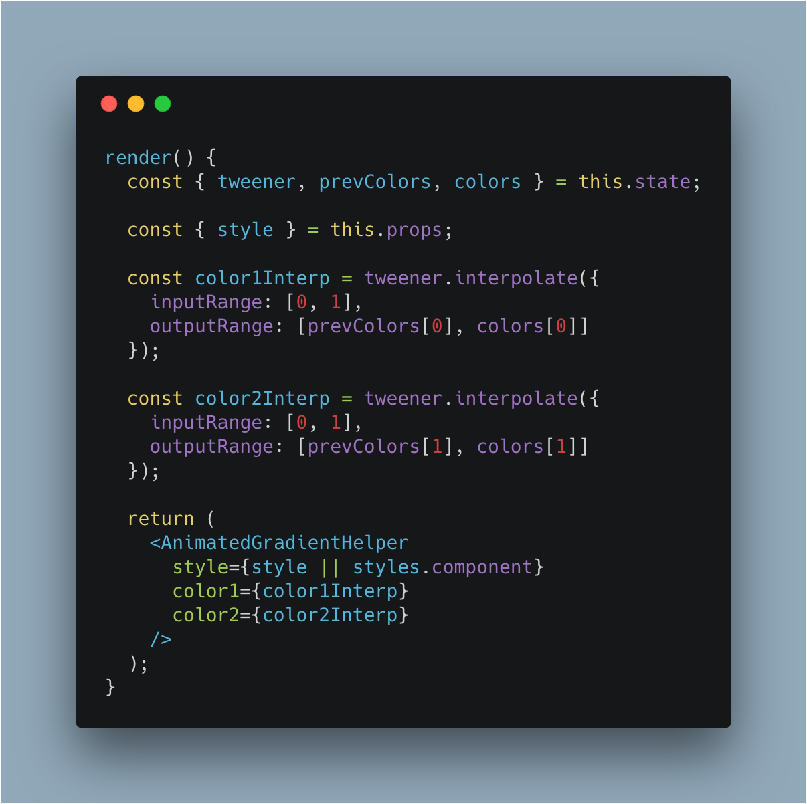
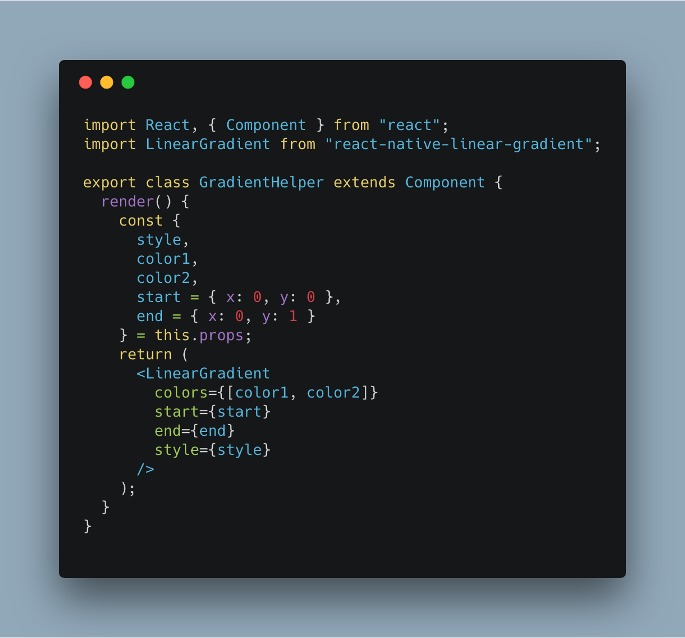
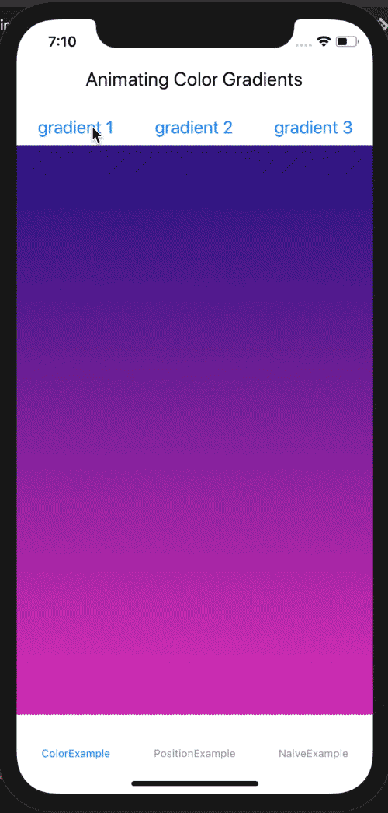
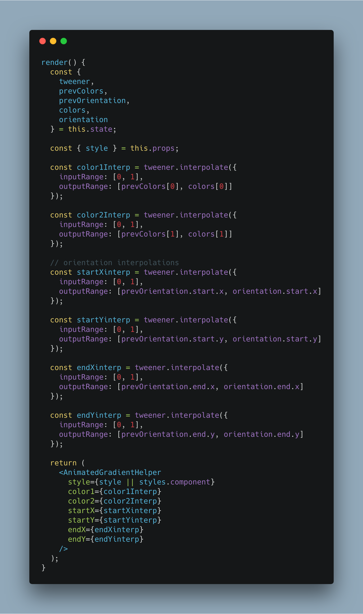
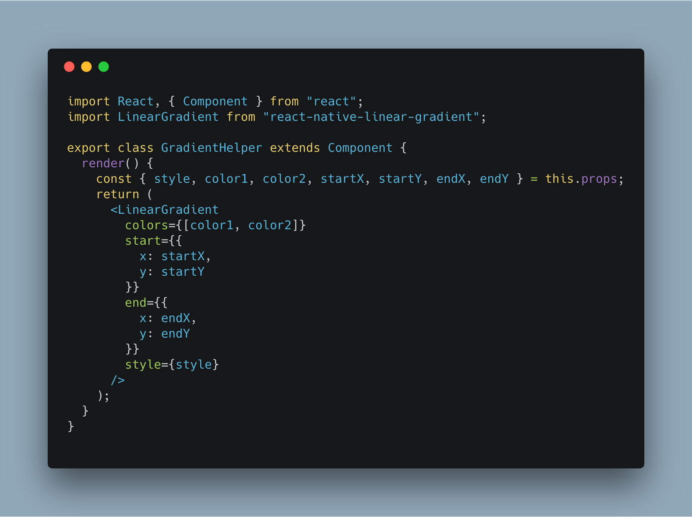

# rn-animated-gradient-example

An example of how to animate gradients in React Native. To run this project:

```
yarn
yarn start
react-native run-ios
```

# Animating Gradients in React Native

I'm working on a personal project called KaoCards, a flashcard app for remembering people's names and faces. When I designed the product I thought it'd be cool to have an animated gradient as the background, but when I tried to implement, it turned out to be more work than I thought.

I posted about my progress on Twitter, https://twitter.com/GroundControl/status/1064333987143999489, and I was asked to write this tutorial about it.

So here's the story of how I managed to get it working. [I made a repository you can follow along](https://github.com/dslounge/rn-animated-gradient-example).

# The naive attempt

To display an animated gradient in React Native, people use a project called [react-native-linear-gradient](https://github.com/react-native-community/react-native-linear-gradient). I wanted to see if anybody had tried animating the colors, and I found the [Animated Gradient Transition example](https://github.com/react-native-community/react-native-linear-gradient/tree/master/Examples/AnimatedGradientTransition) on that repo. Looking through the code, I had this reaction:



I didn't understand why it needed two classes, why there was so much code. I didn't think you'd need that much. I decided I wasn't going to bother understanding all of that. I figured the way to get this done should be quite simple:

1. create an `AnimatedLinearGradient` component using `Animate.createAnimatedComponent`
2. interpolate some colors and pass them to `AnimatedLinearGradient`

Simple, right? I made an expermental app, ran it, and then, _womp womp_.


We get the error:

```
JSON value `<null>` of type NSNull cannot be converted to a UIColor. Did you forget to call processColor() on the JS side?
```

Something somewhere down the line wasn't getting colors values. So I turn to twitter for help:

https://twitter.com/GroundControl/status/1064019174400364544

Jason Brown responded with the key insight:

https://twitter.com/browniefed/status/1064028092023197696

Aaahhh ok! _Animated doesn't work with arrays._ Although I thought I was doing everything correctly, the Animated library doesn't process the values of array props, so the underlying native component is getting garbage instead of getting colors.

It became clear why the original example was so big.

# Building it correctly

Ok, understanding this limitation about Animated, let's modify our game plan and make it a little more robust.

1. We want our main component, `AnimatedGradient`, to work just like `LinearGradient`. It should take an array of colors.

2. We want a transition to occur when we change the `colors` prop. To do this, `AnimatedGradient` needs to keep track of the previous colors.

3. Since we can't animate values in arrays, we can build a `GradientHelper` component that takes colors individually, and call `Animated.createAnimatedComponent` on _that_. `GradientHelper` will put the values into an array and pass them to the `LinearGradient` component from the `react-native-linear-gradient` package.

To keep things simple for this example, we're going to assume that the `colors` array only has 2 values.

## AnimatedGradient component

[Source Code](https://github.com/dslounge/rn-animated-gradient-example/blob/master/src/ColorExample/AnimatedGradient/index.js)

First, we'll create an `AnimatedGradientHelper` out of our `GradientHelper`, which we'll make in a bit.



In the constructor of `AnimatedGradient`, we'll initialize a `prevColors` state field to keep track of the previous colors. We also initialize an `Animated.Value` called `tweener`.



In `getDerivedStateFromProps`, we take the `state.colors` value and stick in `state.prevColors`. We set the new `state.colors`, and we reset the tweener.


In `componentWillUpdate` (aka when props change), we'll make the tweener move from 0 to 1.



In the `render` method, we use the `tweener`, `prevColors`, and `colors` to create two color interpolations, and pass them individually to our `AnimatedGradientHelper`.



## Gradient Helper

[SourceCode](https://github.com/dslounge/rn-animated-gradient-example/blob/master/src/ColorExample/AnimatedGradient/gradient-helper.js)

In `GradientHelper`, all we're doing is taking the `color1` and `color2` props, putting them into an array, and passing that to `LinearGradient`. We're doing this because we need to get around Animated's



And that's the gist of it. Here's the demo:



Now we know why the original example is so big. It had to do all this stuff, and handle gradients with more than 2 colors.

# But wait, what else can we animate?

We can actually go the extra step and animate other properties. The LinearGradient component lets you specify coordinates for the start and end of the gradient. Why don't interpolate those too? Here's an updated render method. You can probably guess what happened in the rest of the component. [Source](https://github.com/dslounge/rn-animated-gradient-example/blob/master/src/PositionExample/AnimatedGradientWithPosition/index.js)



We'll just need to tweak our `GradientHelper` a bit by doing something with the props. [Source](https://github.com/dslounge/rn-animated-gradient-example/blob/master/src/PositionExample/AnimatedGradientWithPosition/gradient-helper.js)



And now we have a cooler demo.


I was able to combine this animated gradient with some other animations to create a cool background effect for my KaoCards project:

https://twitter.com/GroundControl/status/1064700437670973440

So, now you know how to animate gradients in react native, and a little bit more about how Animated works. What other properties do you think you can animate?

Thanks to Jason Brown for providing the key insight. Everything I've learned about animating stuff in React Native I've learned from him. Make sure you follow him on [Twitter](https://twitter.com/browniefed), and check out his [React Native Animations course](https://reactnativeanimations.com/).
